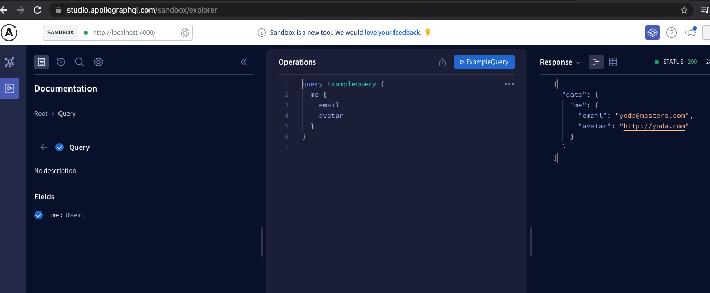

## 1. Steps to create a basic GQL server

1. Create typeDefs
2. Create resolvers
3. Create GraphQL server and pass typeDefs and resolvers
4. Run the GQL server and the GQL playground should open on the port you've specified.

